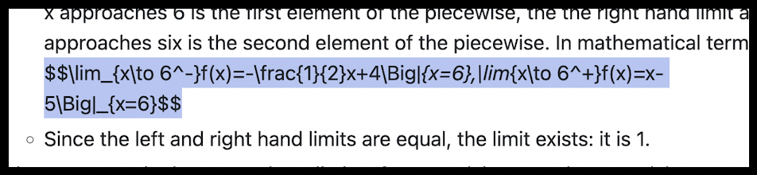

# I need notes!

Hello! If you're here, you probably missed some notes in your pre chem class, or couldn't follow up with the calculations.

This repository is a collection of my notes that will update throughout the year, so if you just couldn't jot down that formula your chem teacher was writing, you can hop into the [chemistry folder](https://github.com/Tyrcnex/23-24-notes/tree/main/course-notes/chemistry) to find what you're looking for.

## Alright, how do I find the notes?

Go to the [course-notes](https://github.com/Tyrcnex/23-24-notes/tree/main/course-notes) folder and find the notes on the subject you need. Generally, the folders will have an "assignments" and "notes" section. Click into the notes section to get my notes. Some of them have a date, some of them don't. For example, ~~here is the assignments section for chemistry~~, and [here is the notes section for chemistry](https://github.com/Tyrcnex/23-24-notes/tree/main/course-notes/chemistry/notes).

EDIT Aug 19 2023: I'm removing the assignments folder, just in case something like last year's incident happens again. I'm sure notes are fine, so I'll still post my notes here.

## Why didn't you take notes on \[insert something here\]?

I may not be able to take notes every single lesson, but I will try my best to. If you DID take notes that day, could you send them to me? You can contact me on Discord: my username is **tyrcnex**.

## My course notes aren't here!

I do not take every course in the school. I also don't take notes in every single course I'm in. The courses I'm in, sorted by my own perception of difficulty, is:
- AP Seminar
- Pre-AP Chemistry ([folder here](https://github.com/Tyrcnex/23-24-notes/tree/main/course-notes/chemistry))
- AP Calc BC ([folder here](https://github.com/Tyrcnex/23-24-notes/tree/main/course-notes/calcBC))
- AP CSP ([folder here](https://github.com/Tyrcnex/23-24-notes/tree/main/course-notes/csp))
- French II
- Art Foundation
## What are those weird dollar signs and code thingies in the notes?

For some reason, Github markdown doesn't use certain important LaTeX packages such as `amsmath`, and it's pretty limited. I take my notes in Obsidian with a very nice LaTeX renderer. When ported to Github, the math notation may render wrong and unformat the rest of the content. If so, I apologize. I hope this only happens in the Calc BC notes, which is the course that you guys probably aren't in.

---

I'm open for suggestions on how to organize this repository to help people out.

Let's have a fun year, guys!

\- Tyrcnex (real name omitted)