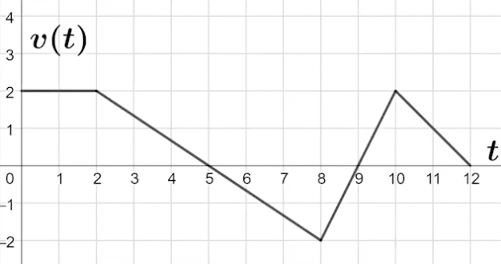

Date: **CHANGE THIS**

## Raw Notes

- In most cases:
    - Position is represented by $s(t)$, $x(t)$, or $y(t)$.
    - Velocity is represented by $s'(t)$ or $v(t)$.
    - Acceleration is represented by $s''(t)$, $v'(t)$, or $a(t)$
- Acceleration and speeding up are usually the same thing in English, but they are not the same thing in calculus.
    - Speeding up means that $v(t)$ and $a(t)$ have the *same sign*.
    - Slowing down means that $v(t)$ and $a(t)$ have a *different sign*.
    - To see why this is, forget the sign for now and think of a *direction*. If you're moving in a direction, the acceleration is you being *pushed* in a direction. If you're being pushed in the *same direction that you're already moving in*, then that means you are speeding up. If you're being pushed in a different direction than you're already moving in, you're slowing down.
- When a question gives you a graph or a function, *check if it's a position, velocity, or acceleration* function. For example, if the question gave you the velocity and asked you to find the acceleration, you would differentiate the velocity function once. If you didn't read the question and thought the velocity function was the position function, you might have differentiated it twice, and you would have gotten the wrong function.

## Problems

1. The velocity of a bug moving along a horizontal path is modeled by the graph of $v(t)$ shown above.

a. Find the acceleration of the bug at time $t=6$. Is the bug speeding up or slowing down at $t=6$? Give a reason for your answer.

b. For $0\leq t\leq12$ at what time(s) is the bug at rest? Give a reason for your answer.

c. On what open interval(s) is the bug moving left? Give a reason for your answer.

**Answer:**

We must notice that the graph of $v(t)$ is given, NOT $x(t)$ or $a(t)$.

a. $a(6)=v'(6)=-\frac{2}{3}$
$v(6)<0$, and $a(6)=-\frac{2}{3}<0$. Since $v(6)$ has the same sign as $a(6)$, the bug is speeding up at $t=6$.

b. The bug is at rest when $v(t)=0$. This is at $t=5$ and $t=9$.

c. The bug is moving left when $v(t)<0$. This is on the interval $(5,9)$.

___

2. For $t\geq 0$ seconds, a particle moving along the $x$ axis has velocity $v$ defined by the function $$v(t)=\frac{\ln(t^2+1)-3}{t^{2.1}+\sin(t)}$$
where $v(t)$ is measured in meters per second.

a. Find $a(3)$.

b. It is known that $x(4)=-3$. Is the particle moving toward or away from the origin at this moment? Give a reason for your answer.

**Answer:**

a. $a(3)=v'(3)$. Entering this into a graphing calculator with `nDeriv`, we find that this value is $\approx 0.09951$.

b. At $t=4$, the particle is to the left of the origin. Therefore, if the velocity is negative, then it is moving away from the origin; otherwise, if the velocity is positive, then it is moving towards the origin. Plugging in $t=4$ to $v(t)$ yields a value $\approx -0.00946$. Since $v(t)<0$, the particle is moving away from the origin.

## Key Takeaways

## Questions

