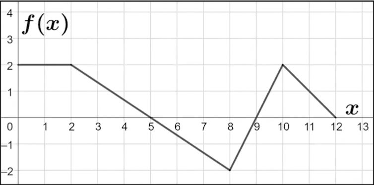

Date: **CHANGE THIS**

## Raw Notes

- We're back to limits!
- Before, to solve a limit such as the one shown below, we would have to factor first: $$\lim_{x\to3}\frac{x^2-9}{x^2-8x+15}=\lim_{x\to3}\frac{\cancel{(x-3)}(x+3)}{\cancel{(x-3)}(x-5)}=-3$$
- Now, however, we have something new: L'Hopital's rule. Basically the rule is as follows: 
    - If you have two functions $f$ and $g$ where $\lim_{x\to c}f(x)=0$ and $\lim_{x\to c}g(x)=0$, then $$\lim_{x\to c}\frac{f(x)}{g(x)}=\lim_{x\to c}\frac{f'(x)}{g'(x)}$$
    - **REMEMBER: to apply this rule, the LIMITS OF $f$ and $g$ MUST EQUAL 0.**
- For example, to solve the problem that we presented at the beginning, we first note that $\lim_{x\to 3}x^2-9=0$ and $\lim_{x\to 3}x^2-8x+15=0$. Therefore, we can apply L'Hopital's rule as follows: $$\lim_{x\to3}\frac{x^2-9}{x^2-8x+15}=\lim_{x\to 3}\frac{2x}{2x-8}=-3$$
- This rule enables us to solve limits that we couldn't have solved before. For example: $$\lim_{x\to 0}\frac{e^{x^2+3x}-\cos x}{5x}$$
    - Note that the limit of the numerator as x approaches 0 is $e^{0^2+3(0)}-cos(0)=0$, and the limit of the denominator as x approaches 0 is $5(0)=0$. Therefore, we can apply L'Hopital's rule. Differentiating the numerator and denominator yields: $$\lim_{x\to 0}\frac{e^{x^2+3x}\cdot(2x+3)+\sin x}{5}=\frac{e^{0^2+3(0)}\cdot(2(0)+3)+\sin 0}{5}=\boxed{\frac{3}{5}}$$
- We can also use this in conjunctions with graphs and tables. Let's say we have the following graph of $f(x)$:

and we're asked to find the following: $$\lim_{x\to 5}\frac{f(2x-1)}{10-2x}$$

- We see that $f(2(5)-1)=f(9)=0$ and $10-2(5)=0$. Therefore, we can apply L'Hopital's rule. Differentiating the numerator and denominator yields: $$\lim_{x\to 5}\frac{f'(2x-1)\cdot2}{-2}=-\lim_{x\to5}f'(2x-1)=-f'(9)=\boxed{-2}$$
*Additional note:* Here's the proof of why L'Hopital's Rule works:

Let there be a constant $c$ and two functions $f$ and $g$ such that $f(c)=0$ and $g(c)=0$. Then, using these two equalities, we can write the limit like so: $$\lim_{x\to c}\frac{f(x)}{g(x)}=\lim_{x\to c}\frac{f(x)-f(c)}{g(x)-g(c)}$$
The last step holds because $f(c)=g(c)=0$. Now, we can divide the numerator and denominator by $x-c$: $$\lim_{x\to c}\frac{\frac{f(x)-f(c)}{x-c}}{\frac{g(x)-g(c)}{x-c}}=\lim_{x\to c}\frac{f'(x)}{g'(x)},\text{ QED}$$
REMEMBER: this only works when $f(c)=g(c)=0$, which is why this is a requirement for L'Hopital's rule.
## Key Takeaways

## Questions

