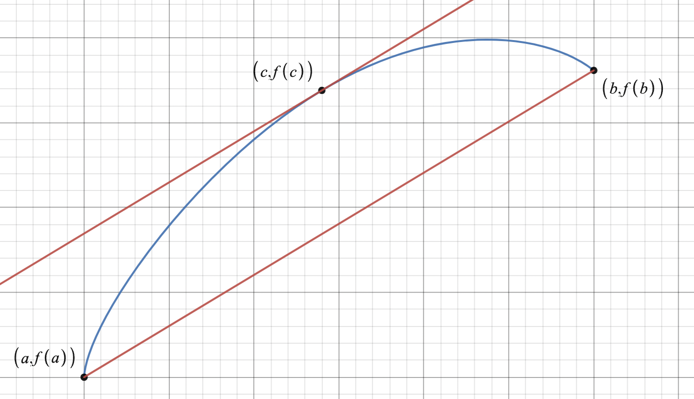
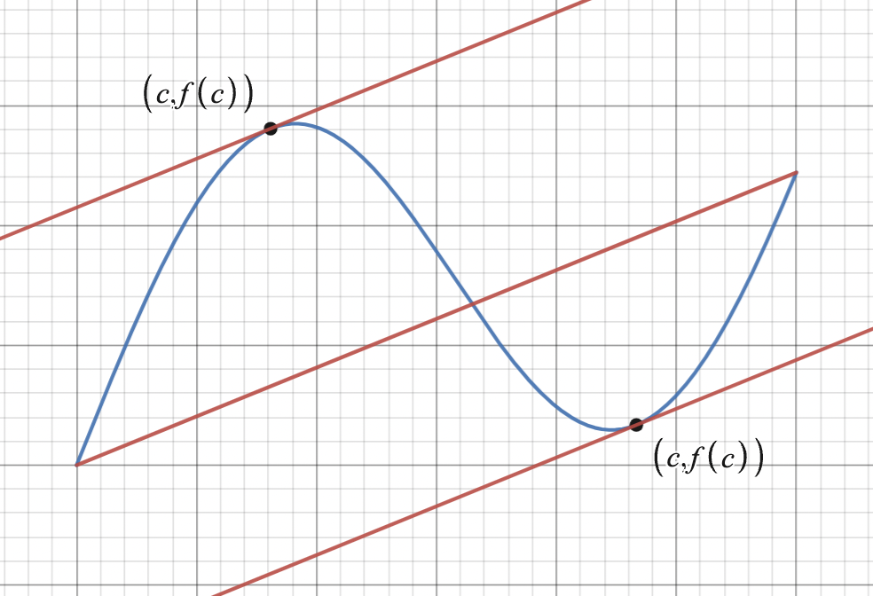

Date: **CHANGE THIS**

## Raw Notes

- The Mean Value Theorem states that, for some function $f(x)$ that is continuous on $[a,b]$ and differentiable on $(a,b)$, there exists at least one number $c$ on the open interval $(a,b)$ such that the instantaneous rate of change at $c$ equals the average rate of change over the interval. In other words: $$f'(c)=\frac{f(b)-f(a)}{b-a}$$
- Geometric interpretation: 

- We can see here that there is a point $(c,f(c))$ such that it has the same slope as the secant line connecting $(a,f(a))$ and $(b,f(b))$.
- Note that this is an *existence theorem*. This means that the theorem doesn't tell us how to find that point $(c,f(c))$, it just tells us that it *exists*.
- Note that it's possible for multiple $c$ values to exist. For example: 

- Here is an example problem. What does the Mean Value Theorem say about $f(x)=x^2-6x+12$ on the interval $[2,6]$?
    - Since $f(x)$ is a polynomial, it is continuous and differentiable everywhere, including on the interval $[2,6]$. Therefore, the MVT concludes that there is at least one point $c$,  $2<c<6$, where $$f'(c)=\frac{f(6)-f(2)}{6-2}=\frac{12-4}{4}=2$$
- Now let's see why it has to be continuous and differentiable. 
    - Continuity:
        - Consider the sign function, which is not continuous at $x=0$. We know that it has a slope of 0 everywhere except at $x=0$. The average rate of change on the interval $[-1,1]$ is $$\frac{\mathrm{sign}(1)-\mathrm{sign}(-1)}{1-(-1)}=1$$
        - However, we KNOW that the slope is always 0, and it is never equals to 1.
    - Differentiability:
        - Consider the absolute value function. It is continuous everywhere but non-differentiable at $x=0$. It has a slope of $-1$ for $x<0$ and a slope of $1$ for $x>0$. The average rate of change on the interval $[-1,1]$ is $$\frac{|1|-|-1|}{1-(-1)}=0$$
        - However, the slope is never 0.
    - Continuity on an OPEN interval:
        - Consider the following piecewise function: $$f(x)=\begin{cases}x&\text{if }x\neq0\\5&\text{if }x=0\end{cases}$$
        - Now, let's say we wanted to apply the Mean Value Theorem to the interval $[0,5]$. $f(x)$ is differentiable (and therefore continuous) on $(0,5)$, but it is NOT continuous on $[0,5]$.
        - $$\frac{f(5)-f(0)}{5-0}=\frac{5-5}{5}=0\neq\frac{d}{dx}x=1$$
        - Therefore, the MVT cannot apply when it is not continuous on a closed interval.
- Remember: the MVT applies on an *interval*. This means that a function was not continuous/differentiable over the *real numbers*, you just need to pick an interval where it is continuous/differentiable.
    - For example, take: $$f(x)=\frac{1}{x}$$
    - This is not continuous at $x=0$, so the MVT would not apply to the interval $[-2,1]$. However, it WOULD apply to $[1,2]$ because $0$ is not on that interval.
    - On the other hand, take $$g(x)=\left|x\right|$$
    - This is continuous everywhere but not differentiable at $x=0$, so the MVT would not apply to the interval $[-2,2]$. It *would*, however, apply to $[0,3]$, because it is continuous on $[0,3]$ and differentiable on $(0,3)$.
## Key Takeaways

## Questions

