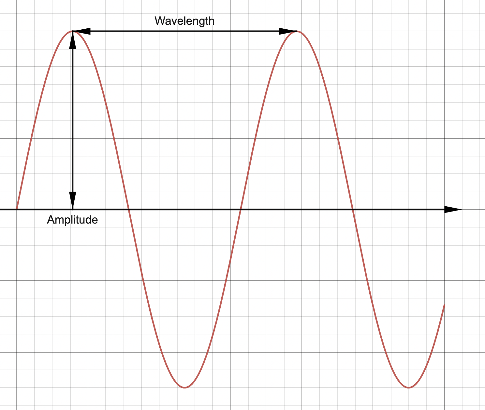
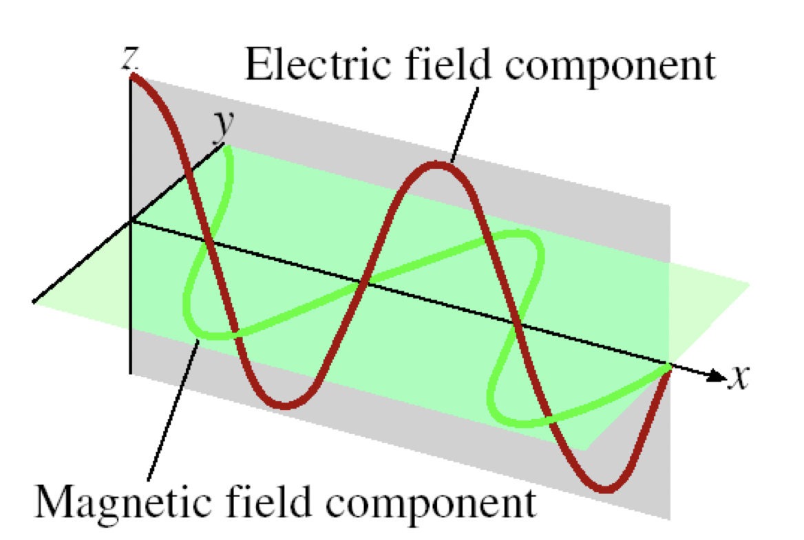

Date: **CHANGE THIS**

## Notes

Let's first look at a wave. It looks like a sine curve, with peaks or troughs, though I'm going to refer to them as hills and dips.

There are a few properties of waves.

> **Wavelength** is the distance between identical points on successive waves

You can think of this as the distance between the two closest "hills" of a wave.

> **Amplitude** is the vertical distance from the midline of a wave to the peak or a trough.

You can think of this as the "height" of a hill.

Here is a picture showing wavelength and amplitude. 
> **Frequency** is the number of waves that pass through a particular point in 1 second (Hz = 1 cycle/s)

Think about it like this: The wave starts appearing from the left, moving up and and down as it moves to the right. After one second, how many hills are there?

> The **speed** of a wave is a relationship between wavelength and frequency. The formula is as follows: $$\text{speed}=\text{wavelength}\times\text{frequency}$$
    From now on though, I'm going to refer to these variables with letters: speed will be represented as $u$, wavelength represented as $\lambda$, and frequency represented as $v$. Therefore the above formula would be:  $$u=\lambda\times v$$
- Don't be intimidated by the symbols, just remember what they represent.

___

These properties of waves are especially important when using electromagnetic waves.

Electromagnetic waves are very important, because they're used in so many parts of our modern world. For example:
    - Microwaves use electromagnetic waves to heat our food.
    - These waves encode certain information that enables us to use wireless transmission. They allow us to connect to the Internet!
    - Among so many other things in science, such as medical inventions such as X-Rays, they make up visible light, which renowned physicist James Clerk Maxwell found out in 1873. (search him up, he has an AWESOME beard)

Now, I'm going to clear up a common misconception. The term "light" is often used colloquially as "visible light", but in the science world, all electromagnetic waves ARE light. This means that stuff like X-ray beams, microwave waves, those are all light too.

Now, this is an electromagnetic wave. 

Technical bit: Why there are two waves (Optional)

 
As you saw in the picture, there are two waves: the electric field wave, and the magnetic field wave.

Now, you might know that the speed of light can be rep

## Key Takeaways

## Questions

