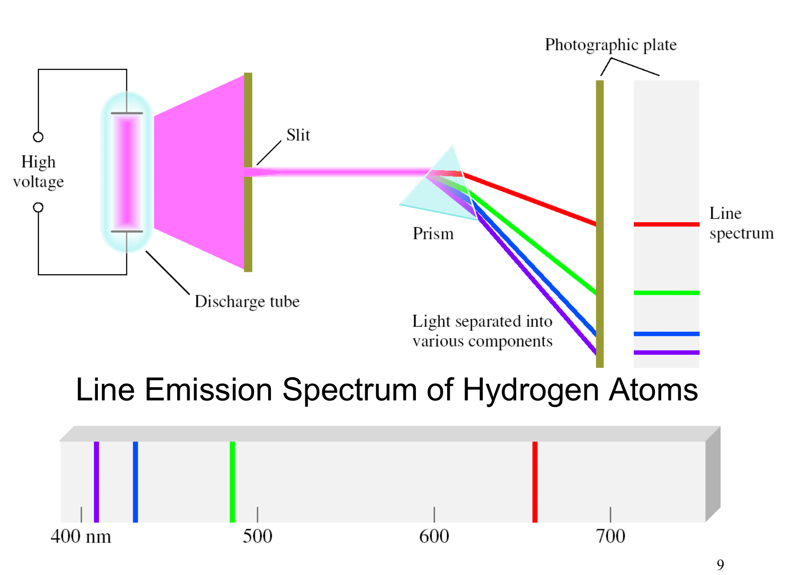

Date: **CHANGE THIS**

## Notes

Let's first look at a wave. It looks like a sine curve, with peaks or troughs, though I'm going to refer to them as hills and dips.

There are a few properties of waves.

> **Wavelength** is the distance between identical points on successive waves

You can think of this as the distance between the two closest "hills" of a wave.

> **Amplitude** is the vertical distance from the midline of a wave to the peak or a trough.

You can think of this as the "height" of a hill.

Here is a picture showing wavelength and amplitude. 
> **Frequency** is the number of waves that pass through a particular point in 1 second (Hz = 1 cycle/s)

Think about it like this: The wave starts appearing from the left, moving up and and down as it moves to the right. After one second, how many hills are there?

> The **speed** of a wave can be represented with a relationship between wavelength and frequency. The formula is as follows: $$\text{speed}=\text{wavelength}\times\text{frequency}$$
    From now on though, I'm going to refer to these variables with letters: $u$ means speed, $\lambda$ means wavelength (typically measured in meters/nanometers), and $v$ means frequency (measured in Hz). Therefore the above formula would be:  $$u=\lambda\times v$$This is known as the **wave speed equation**. Don't be intimidated by the symbols, just remember what they represent.

___

These properties of waves are especially important when dealing with electromagnetic waves.

Electromagnetic waves are very important, because they're used in so many parts of our modern world. For example:
    - Microwaves use electromagnetic waves to heat our food.
    - These waves encode certain information that enables us to use wireless transmission. They allow us to connect to the Internet!
    - Among so many other things in science, such as medical inventions such as X-Rays, they make up visible light, which renowned physicist James Clerk Maxwell found out in 1873. (search him up, he has an AWESOME beard)

Now, I'm going to clear up a common misconception. The term "light" is often used colloquially as "visible light", but in the science world, all electromagnetic waves ARE light. This means that stuff like X-ray beams, microwave waves, those are all light too.

Electromagnetic waves with a frequency between 400Hz (dark blue) and 700Hz (red) represent visible light.

Now, this is an electromagnetic wave. 
It's a bit difficult to explain why there are two waves, and I don't quite understand it completely, but I think it's like this. 

- A charged particle, like an electron, has an electric field.
- A charged particle that's *moving* has a magnetic field.
- When the charged particle is *accelerating*, however, it has an electric field AND a magnetic field. (we will talk about this later)

Now, you might know that the speed of light can be represented as the value $c$, which is around $3\times 10^8 \text{m/s}$ (300 million meters per second).

Now, according to the formula for the speed of the wave, $u=\lambda\times v$. Since $u$ is speed, we can plug in $c$ into the speed to get a wave speed equation for electromagnetic wave: $$\lambda\times v=c$$

Let's try a sample problem that they might give you.

> **Problem 1:** An electromagnetic wave has a frequency of $6.0\times 10^4\text{ Hz}$.
> 
> a) Does this frequency fall in the region of visible light? Give a reason for your answer.
> b) Find the wavelength of this electromagnetic wave in nanometers (nm).

Answer to a) (click to expand)

> This does not fall inside the region of visible light. The frequency of visible light ranges from 400Hz to 700Hz, but the frequency of this wave is 60,000Hz. It's closer to the frequency of ultrasound waves.

Answer to b) (click to expand)

> We will use the wave speed equation for electromagnetic waves and solve for $\lambda$. 
> 
> $$\lambda\times v=c$$
> $$\lambda=\frac{c}{v}=\frac{3\times10^8\text{ m/s}}{6\times10^4\text{ Hz}}$$
> 
> Now we need to do a little ✨dimensional analysis✨. Hz is measured in "inverse seconds", and so the $/s$ cancels out, and we get an answer in meters. We solve: $$\lambda=\frac{3\times10^8}{6\times10^4}\text{ m}=5\times10^3\text{ m}=5000\text{ m}$$
> We have to use a conversion factor to convert from meters to nanometers. A meter is $10^9$ nanometers, so we multiply by $10^9$: $$\lambda=5\times10^3\times10^9\text{ nm}=\boxed{5\times 10^{12}\text{nm}}$$

___

Remember when I said that accelerating charged particles have an electric field and a magnetic field? Well, there are two ways this can happen. We will talk about the first one for now, and talk about the second way later.

When you heat a block of metal, it emits *red and infrared light*, turning it red. If you heat it more, it turns yellow, and if you heat it even more, it turns bright white. In general, when solids are heated, they emit something called *radiant energy*. 

On the atomic scale, this energy is emitted or absorbed in *discrete units* (science talk for "very small amounts"), and we can actually describe it with an equation made by a guy called Max Planck.

He found out a constant called $h$, which is in Joule-seconds ($\text{J}\cdot \text{s}$), which I interpret as inverse seconds. (Joules is a measure of energy). This constant is very small, it's around $0.0000000000000000000000000000000000663$, or $6.63\times10^{-34}$ Joule-seconds. Then, the energy ($E$) can be represented as: $$E=h\times v$$

Ah, our good friend, the frequency. This equation (known as the **energy frequency relationship**) tells us that, the higher the frequency, the higher the energy level. In general, *heating an object emits higher frequency waves, which in turn emits more energy.* Keep in mind, though, that this is usually affected by a few different factors, such as the actual properties of the object being heated.

> **Mini note: linkage between wave speed equation and energy frequency relationship**
> 
> We can use the wave speed equation for electromagnetic waves to generate a second form of the energy frequency relationship. Rearranging the wave speed equation yields: $$v=\frac{c}{\lambda}$$
> Plugging this value of $v$ into the energy frequency relationship turns into $$E=\frac{c\times h}{\lambda}$$
> This form is, in some scenarios, more useful than the first form of the energy frequency relationship.

Let's try solving a problem with this energy .

> **Problem 2:** When copper is bombarded with high-energy electrons, X-rays are emitted. Calculate the energy (in joules) associated with each electron if the wavelength of the X-rays is 0.154 nm.

Answer (click to expand)

 

> First let's convert from nanometers to meters. We can simply write $0.154\times10^{-9}\text{ m}$.

> Now, we can use the second form of the energy frequency relationship. Plug in $\lambda = 0.154\times 10^{-9}\text{ m}$ and solve: $$E=\frac{c\times h}{\lambda}=\frac{(3\times10^8\textcolor{red}{\cancel{\text{m}}}/\textcolor{blue}{\cancel{\text{s}}})(6.63\times 10^{-34}\text{ J}\cdot\textcolor{blue}{\cancel{\text{s}}})}{0.154\times 10^{-9}\textcolor{red}{\cancel{\text{m}}}}=1.29\times10^{-15}\text{ J}$$
> > **Mini-note:** I've seen a lot of students struggle with units, so I'll try to clear up why the unit cancelling in this formula works. First of all, note that the $/\text{s}$ and $\cdot\text{s}$ cancel out because division is the inverse of multiplication. Then, notice that the first $m$ is in the numerator and the second $m$ is in the denominator; hence, they cancel out. We are left with joules ($J$).

___

Alright, remember when I said that accelerated charged particles have an electric field and a magnetic field, and that there were two ways that this could happen? Well, I'm going to explain the second way now.

You might know Bohr's model of the atom: it's the most commonly known way to draw an atom. It consists of a nucleus in the center (made of protons and neutrons) and rings of electrons on the outside.

Now, I'm going to talk about energy levels and "excited" electrons. This topic usually involves a lot of math, but I'm going to skip that first and talk about what it really means.

Usually an electron stays in its own ring (actually, it's called a **shell**). However, occasionally a particle

These rings are called **shells**, and the amount of energy that an electron has in each shell is called the **energy level**. As a rule of thumb, electrons like to stay closer to the nucleus (i.e. the center of the atom) because it uses *less energy to orbit*.

There is something called the **principal quantum number** that tells us which shell an electron is in. It is represented by the variable $n$. The innermost "ring", or shell, has $n=1$. The next ring has $n=2$, then the next ring has $n=3$, etc.

Why is this number important? Well, it lets us determine the *energy level* of an electron given the shell it's in. In other words, given the shell (ring) that an electron is in, we can find how much energy the electron contains. The formula is as follows: $$E_n=-R_H\cdot\left(\frac{1}{n^2}\right)$$
This equation sure looks scary, but you're really just plugging in values. 
- $R_H$ is just another constant: it's equal to $2.18\times10^{-18}$ Joules, which makes sense because an electron is so small—it can't hold THAT much energy. 
- Then, all you need to do is look at which shell the electron is and plug that into $n$. 
- Oh, and don't forget the negative sign, because the charge of an electron is negative.

Usually, an electron stays in the shell, but sometimes some random particle from space hits the electron and "excites" it, moving it up a ring. Since moving up a ring requires *more energy*, the electron will *absorb some energy*.

But as many children can tell you, downing a giant bag of Skittles is bound to give anyone a sugar crash later on. It's the same with electrons: an "excited" electron has to eventually drop back down to its initial level. Since moving down a ring requires *less energy*, the electron will *release some energy*.

This can actually be represented mathematically. You don't have to know how to 

This math is getting boring, but there are some cool effects when you apply this stuff in practice! You can click the dropdown below to look at an experiment with subjecting hydrogen atoms to high voltage.

High voltage hydrogen experiment (click to expand)

> Fill a discharge tube with hydrogen. Place a plate with a tiny slit next to it. Then, subject the discharge tube to high voltage and place a prism on the light emitted from the slit.
> 
> You should see a split into 4 colors: ultraviolet, blue, green, and infrared.
> 
> 
> 
> You can also do this with other elements. Here 

 

%%add stuff on photoelectric effect here i dont quite understand it yet lol%%

## Key Takeaways

## Questions

