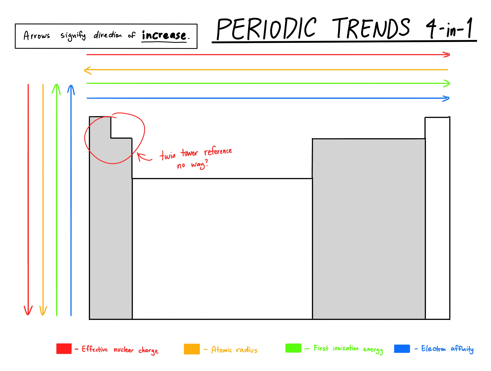

# Protons, Electrons, and Neutrons + Ions
The atom is made up of three subatomic particles: protons, neutrons, and electrons. The protons and neutrons are concentrated in the center of the atom, while the tiny electrons fly around the nucleus.

- Proton: Has a positive charge (+1)
- Neutron: Has a neutral charge (0)
- Electron: Has a negative charge (-1)

The electron is very small, so it doesn't contribute much to the mass of the atom.

Here are some important points:
- The **atomic number** of an atom is the **number of protons** that the atom has. For example, the atomic number of Carbon (C) is 6, so it has 6 protons.
- The **mass** of an atom is the **number of protons plus the number of neutrons**. For example, a specific carbon atom has 6 protons and 8 neutrons, so its mass is 14.

Also remember: *unless otherwise specified, the atom is assumed to be a* **neutral** *atom, so the number of electrons is the same as the number of protons.*

The notation for showing the mass and protons of the Carbon-14 atom (which has a mass of 14) can be written like $\ce{^{14}_{6}C}$ or $\ce{^{14}C}$.
- In $\ce{^{14}_{6}C}$, the 14 signifies the mass, and the 6 signifies the number of protons. Note that we can immediately determine that this atom has $14-6=8$ neutrons.
- The exam might use the second notation $\ce{^{14}C}$. The 6 is omitted because we know the number of protons that carbon (C) has already. Don't get too caught off guard.

Let us look at some examples.

> **Example 1:** Determine the number of protons, neutrons, and electrons in the neutral atom $\ce{^{20}_{11}Na}$.
>
> **Solution:** We immediately know that there are **11 protons**. Since this is a neutral atom, we know that there are **11 electrons**. Now we can determine the number of neutrons by subtracting the mass from the protons: $20-11=9$ **neutrons.**

> **Example 2:** Determine the number of protons, neutrons, and electrons in the neutral atom $\ce{^{17}O}$.
> 
> **Solution:** We know that oxygen has an atomic number of 8, so it has **8 protons**. Since this is a neutral atom, there are **8 electrons**. We can determine the number of neutrons by subtracting the mass from the protons: $17-8=9$ **neutrons**.

> **Example 3:** Determine the number of protons, neutrons, and electrons of the neutral atom Boron-10.
> 
> **Solution:** We know that boron has an atomic number of 5, so it has **5 protons.** Since this is a neutral atom, there are **5 electrons**. When the question says "Boron-10", we know that it has a mass of 10. Therefore to get the number of neutrons, we subtract the mass from the protons: $10-5=5$ **neutrons**.

Now, what if the atom isn't a neutral atom? How would that work?
Well, sometimes atoms want to add or remove electrons to become more stable (we'll explore this more later in this study guide).
- When you add an electron, there is an increased *negative* charge. For example, adding 2 electrons to a neutral oxygen atom ($\ce{O}$) results in an atom with 8 protons and 10 electrons. It is written as $\ce{O^{2-}}$, the minus sign signifying a negative charge.
- When you remove an electron, there is a *positive* charge. For example, removing an electron from a neutral sodium atom ($\ce{Na}$) results in an atom with 11 protons and 10 electrons. It is written as $\ce{Na^{1+}}$, or just simply $\ce{Na^+}$, the plus sign signifying a positive charge.

An ion with a positive charge (removed electron) is called a **cation**.
An ion with a negative charge (added electron) is called an **anion**.
# Wavelength and Frequency

You will have to use two symbols for wavelength and frequency.
- Frequency is denoted as $\nu$ and is measured in hertz ($\text{Hz}$). When doing calculations, you write it as $1/s$.
- Wavelength is denoted as $\lambda$ and is measured as a length, usually in meters ($\text{m}$) or nanometers ($\text{nm}$).
    - When this wavelength is between 380nm and 700nm, the wave is called *visible light*.

In the exam you will only deal with electromagnetic waves, which go at the speed of light. This is denoted as $c$, and you should memorize this as the value $3\times 10^8 \text{ m/s}$. (or it might be given to you on the exam)

We now have a formula that unifies the speed, frequency, and wavelength: $$c=\lambda\nu$$
We can use this in some problems already! Here is an example:

> **Example 4:** The wavelength of the green light from a traffic signal is centered at 522 nm. What is the frequency of this radiation?
> 
> **Solution:** In the equation $c=\lambda\nu$, we are solving for $\nu$. We can rearrange the equation like this: $$\nu=\frac{c}{\lambda}$$We can first plug in $c=3\times10^8\text{ m/s}$. 
> Then we also know that $\lambda=522\text{ nm}$. To make things easier for ourselves, we can convert this to $\text{m}$. This turns out to be $5.22\times10^{-7}\text{ m}$. 
> Solve for $\nu$: $$\nu=\frac{3\times10^{8}\cancel{\text{ m}}\text{/s}}{5.22\times10^{-7}\cancel{\text{ m}}}\approx5.747\times10^{14}\text{ /s}=\boxed{5.747\times10^{14}\text{ Hz}}$$
> Frequency is measured in $\text{Hz}$, so our calculation checks out.

# Energy of a Photon
When a solid is heated, it emits electromagnetic radiation. Sometimes it appears as visible light, which is why some metals glow red or even yellow when you heat them up a lot.

This emitted energy is carried by something called a photon. It is like a really small (quantum) carrier of energy. We can calculate how much energy it carries in this formula, called Planck's formula: $$E=h\nu$$
- $E$ is the energy emitted. The resulting answer should be in Joules ($\text{J}$) a unit that measures energy/work.
- $h$ is something called **Planck's constant**, and it is around $6.63\times10^{-34}\text{ J}\times\text{s}$.
- $\nu$ is the frequency of the wave. This is covered in the **Wavelengths and Frequency** section above.
    - In some scenarios, we are given the wavelength and not the frequency. Therefore sometimes, instead of $\nu$, we must use $\frac{c}{\lambda}$. In this case, Planck's formula can be rewritten as the following: $$E=\frac{h\times c}{\lambda}$$
We can calculate how much energy a photon emits with this simple formula. Let's try some problems:

> **Example 5:** A photon emitted by an X-ray has a **frequency** of $6\times 10^{18}\text{ Hz}$. Calculate the energy emitted by this photon.
> 
> **Solution:** We wish to solve for $E$ in Planck's formula. 
> We can plug in $h=6.63\times10^{-34}\text{ J}\times\text{s}$.
> We can also plug in $\nu=6\times 10^{18}\text{ /s}$. Remember that $\text{Hz}=\text{1/s}$.
> Now solve for $E$: $$E=(6.63\times10^{-34}\text{ J}\times\cancel{\text{s}})(6\times10^{18}\cancel{\text{ /s}})=3.978\times10^{−15}\text{ J}$$
> Energy is measured in $\text{J}$, so our calculation checks out.

> **Example 6:** My TV remote control emits infrared rays. A photon emitted by my remote control has a **wavelength** of $5\times10^{4}\text{ nm}$. Calculate the energy emitted by this photon.
> 
> **Solution:** We wish to solve for $E$ in Planck's formula. This time, we are given the *wavelength*, not the *frequency*. Therefore we must use the equation $E=\frac{h\times c}{\lambda}$. 
> We can plug in $h=6.63\times10^{-34}\text{ J}\times\text{s}$.
> We can plug in $c=3\times10^8\text{ m/s}$.
> We can also plug in $\lambda=5\times 10^4\text{ nm}$, which can be converted to meters to get $\lambda=5\times10^{-5}\text{ m}$.
> Now solve for $E$: $$E=\frac{(6.63\times10^{-34}\text{ J}\times\textcolor{blue}{\cancel{\text{s}}})(3\times10^8\textcolor{red}{\cancel{\text{ m}}}/\textcolor{blue}{\cancel{\text{s}}})}{5\times10^{-5}\textcolor{red}{\cancel{\text{ m}}}}=3.978\times10^{21}\text{ J}$$
> Energy is measured in $\text{J}$, so our calculation checks out.

# Electron Configuration
### NOTE:
If you already are familiar with electron configuration, just remember that the most important part that you need to learn in the exam is how to figure out the valence electrons (electrons in the outer subshell), what is the outermost subshell, and what atom/ion it represents. For example, $1s^2 2s^2 2p^6 3s^2 3p^2$ represents an atom/ion with 14 electrons and 4 valence electrons (due to the 2 electrons in $3s$ PLUS the 2 electrons in $3p$.). The outer subshell is obviously $3p^2$. This could be a neutral bromide atom ($\ce{Silicon}$), an aluminium anion ($\ce{Se^{-}}$), a chloride cation ($\ce{Cl^{3+}}$), etc.
#### Hotel Dweller Electrons
I like to think of electrons as strange hotel dwellers. The said apartment looks like this: 

Vocabulary:
- Each "floor" is called a **shell**.
- Each section of a shell is called a **subshell**. There are four different types: $s, p, d,$ and $f$. Note that the first floor only has an $s$ subshell, the second floor only has a $s$ and $p$ orbital, etc. (technically, the fifth floor has a $g$ orbital, but none of the elements we know on the periodic table can go that high yet. It's the golden VIP level that no one can afford.)
    - We can specify a subshell by its floor number and type. For example, the $p$ subshell on the second floor is written as $2p$, while the $s$ subshell on the fourth floor is written as $4s$.
- Each subshell has a few rooms, called **orbitals**. Each orbital can hold two electrons. (look at the diagram, each gray box can fit only one electron) Each type of subshell has a different number of orbitals:
    - $s$ subshell: 1 orbital (2 electrons total)
    - $p$ subshell: 3 orbitals (6 electrons total)
    - $d$ subshell: 5 orbitals (10 electrons total)
    - $f$ subshell: 7 orbitals (14 electrons total)

Here are some weird peculiarities of these hotel dweller electrons:
- Electrons prefer the floor (**shell**) closest to the ground and the smallest sections (**subshells**).
- Electrons prefer to live one to a room until each room has one occupant (we'll see more on this in the example below). They will then pair up until each room has two.

Example: Let's try to write the electron configuration for a neutral oxygen atom, which has 8 electrons. From the above information, we know they will fill $1s$ first, then $2s$, then $2p$. Here is the diagram for what will happen: 

However, the general rule that they like lower floors better doesn't *always* hold. For example, in the calcium neutral atom:

Now, the number of **valence electrons** is the real important deal. In the hotel, take the topmost floor with electrons in it. In the above example, it's the fourth floor. Now count the total amount of electrons in the 4th floor: we count 2. Therefore a neutral calcium atom has 2 valence electrons.

The valence electrons can help us determine what group (column) of the periodic table an element is in.

\[**UNFINISHED SECTION: I DON'T HAVE ENOUGH TIME, THIS SHOULD BE AN EASY ENOUGH TOPIC FOR Y'ALL PLS 😭**\]

# Quantum Numbers

# Periodic Trends
There are some trends that you can find in the periodic table. They can help you determine some stuff about an ion or an atom.
### Effective Nuclear Charge
This is the "positive charge", or "attraction" felt by an electron. Generally it **increases going to the right and going down the periodic table.** This is because generally, more protons and more electrons = more attraction, and going to the right and down the periodic table means more protons and more electrons.
### Atomic Radius
Exactly what it sounds like. The radius of an atom. Generally it **increases going to the left and going down the periodic table.**
- Remember, more protons and more electrons = more attraction. More attraction means the protons are pulling the electrons closer to the center, hence a smaller atomic radius. This is why the atomic size decreases as you go to the right: as you go to the right, there are more protons and more electrons, so the atomic radius gets smaller
- It increases as you go down because there's going to be a new subshell every time you go down one step in the periodic table, and hence more shells = more radius.

### Ionization Energy
This is the energy required to *remove* an electron from an atom. The *first ionization energy* removes an electron from a neutral atom to form a cation, and the second ionization energy removes an electron from that cation, and the third... so on.

Generally, a higher ionization energy will always be greater than the last; the second ionization energy is greater than the first, and the third ionization energy is greater than the second, etc.

The first ionization energy has a general trend on the periodic table. It usually **increases going to the right and increases going up the periodic table.**
- On the right of the periodic table, elements already are close to a full subshell (stable), so removing electrons causes it to become less stable. Atoms generally don't like that, so it takes more energy to remove an electron on the right than on the left.
- However, as you go down the periodic table, the outer electrons get farther away from the nucleus, and so there's less attraction. If there's less attraction, aka pull, it's easier to remove the electrons.

### Electron Affinity
The textbook says that electron affinity is the negative of the energy change that occurs when an electron is accepted by an atom in the gaseous state to form an anion. However, I have a different definition.

I like to think of it as the change in how stable the atom gets after you *add* an electron to an atom. For example, when you add an electron to chlorine, it obviously becomes more stable because it has a full outer subshell. Therefore, since it becomes *more* stable, the electron affinity is *positive*.

Actually, a sulfur atom also becomes more stable if you add an electron to it to become chlorine, but it doesn't become as stable as the chlorine example above. So the electron affinity of sulfur is positive, but is less than the electron affinity of chlorine.

On the other hand, electron affinity is generally negative on the left side of the periodic table. For example, sodium likes it when you *remove* an electron, because then it has a full subshell. But when you *add* an electron, that makes it less stable in a sense. So the electron affinity is negative because it gets *less* stable.

Generally electron affinity **increases going to the right and going up the periodic table.** The horizontal trend was explained above: the vertical trend can be explained because elements like oxygen are generally more stable than elements like astatine. Oxygen is a really stable gas that you breathe every day; astatine is an element that's so unstable and dangerous that no one has ever seen how it looks like before.

### Generalized table
Here is a generalized table for the trends:

### \[BELOW SECTIONS AREN'T DONE YET IM SORRY\]
# Lewis Dot Symbols
You will learn how to use these symbols to combine atoms in the next section. You will just learn how to draw individual atoms with Lewis dot symbols in this section.

You need to know how many valence electrons an atom has. Then you have four imaginary boxes around the element, and fill them in like so (I have 8 images below to show how this is done):

# Ionic and Covalent Structures / Lewis Dot Symbols
It's important to know why atoms bond. Generally, atoms want to be *stable*, so they take turns borrowing, sharing, stealing, and giving electrons away, to be stable. They do this in two different ways: ionic and covalent bonding.

An ionic structure generally happens when metals and nonmetals bond. A covalent structure usually happens when non-metals and non-metals combine. 

**I don't think this is on the exam, but it's important to know nevertheless.** Whether a structure is ionic or covalent can be measured with something called electronegativity. There are tables of electronegativity on the internet. But to determine whether a bond is ionic or covalent, you can do some math. You take the electronegativity of both atoms and find the positive difference. If it's greater than 2, it's ionic; otherwise it's covalent. For example:
- $\ce{NaCl}$: The electronegativity of $\ce{Na}$ is 0.9, and the electronegativity of $\ce{Cl}$ is 3. $3-0.9=2.1$, which is greater than 2, so the bond is ionic.
- $\ce{F_2}$: The electronegativity of $\ce{F}$ is 4. $4-4=0$, which is less than 2, so it is a covalent bond.
- $\ce{ClF}$: The electronegativity of $\ce{Cl}$ is 3, and the electronegativity of $\ce{F}$ is 4. $4-3=1$, which is less than 2, so the bond is covalent.

Now, what are these bonds, and how do we represent them?
## Ionic bonds
Ionic bonds happen when an atom **transfers/takes electrons** from another atom to form two ions. For example, in $\ce{NaCl}$, the lone valence electron in $\ce{Na}$ goes to the $\ce{Cl}$ atom. Therefore the resulting molecule becomes something like this: $$\ce{Na^+}\left[\ce{Cl^-}\right]$$
The Lewis dot diagram will be represented like this