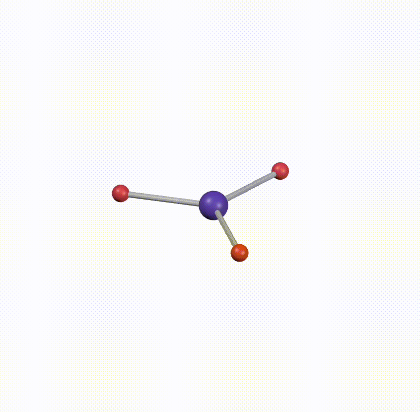
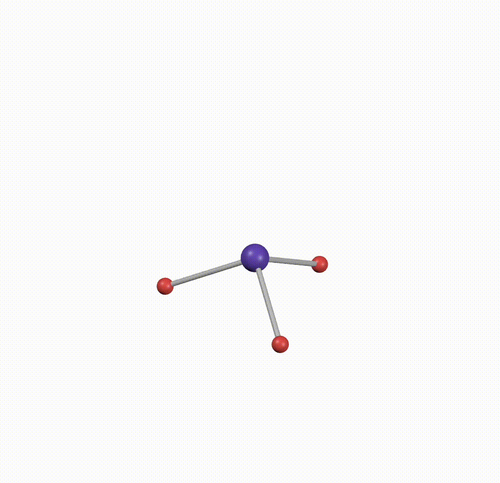

#### Inter vs. Intramolecular Forces
**Intermolecular** forces are interactions *between* molecules. Think of a little $\ce{H_2O}$ blobby molecule holding hands with another $\ce{H_2O}$ blobby molecule. This topic will be on the test, and it will be covered in the next section of this study guide.
**Intramolecular** forces are interactions *within* molecules. Think of the little H and O atoms in the $\ce{H_2O}$ molecule linking arms together. I don't think this will be on the test, but all you need to know is that these consist of ionic (think of $\ce{NaCl}$) and covalent bonds (think of $\ce{F_2}$).
## Intermolecular Forces
The starting point for intermolecular forces are **dipoles**. 
#### Dipoles
If you think of two atoms with different electron repel strengths (electronegativity), and one repels stronger than the other (higher electronegativity), the electrons will generally be more attracted to the weaker atom. Think of it as a mom and a dad. If your dad generally isn't that strict, you'll want to stick with your dad more than your mom.

Now, this "bias" towards one of the molecules is called a **dipole**. But now imagine many different atoms (with bonds) pulling and tugging on each other, creating many different dipoles. For example, let's take the molecule $\ce{BF_3}$. You can think of the three F atoms as sort of like little children trying to get as far away as possible from the "parent", B (boron). Since all the F atoms are the same, they're pulling on B equally in opposite directions. Here's a little animation made in Desmos:

If the atom doesn't "go" anywhere because the atoms cancel each other out when they tug, we call the entire molecule **non-polar**. However, in an atom like $\ce{CH_3OH}$, the dipoles are tugging everywhere, and at the end the molecules start moving. Check this animation:

Notice how, the molecule doesn't end up at its initial position at the purple dot. This means that the molecule is polar. This will be important when we learn about intermolecular forces. This is because many intermolecular forces depend on the dipoles' polarity (?) to interact with one another.

#### Dipole-dipole
Dipoles interact with dipoles in other molecules to form an intermolecular bond.
#### Dispersion (aka London Dispersion Forces)
Dispersion is present in EVERY molecule. This is because, no matter how non-reactive a molecule is, other molecules have the ability to jiggle that molecule a little bit, hence creating this "temporary" dipole. Dipoles and dipoles interact with one another, so this makes an intermolecular force. This is the weakest of the forces, though, since the dipoles are "temporary".
#### Ion-dipole
This is when an ion (such as $\ce{Na^+}$ or $\ce{NH_4^+}$) interacts with the dipoles in a molecule.
#### Hydrogen bonding
This is a special case of dipole-dipole bonding. When one molecule has an H atom and both of the molecules have at least one of EITHER N, O, or F, then hydrogen bonding is present. For example, $\ce{HF}$ and $\ce{H_2O}$ can form hydrogen bonds because one of the molecules has an H atom and both have at least one of either N, O, or F (i.e. $\ce{HF}$ has an F atom, while $\ce{H_2O}$ has an O atom)

### Sorting Intermolecular Forces
Here are the intermolecular forces, ranked from strongest (hydrogen bonding) to weakest (dispersion):
1. Hydrogen bonding
2. Ion-dipole
3. Dipole-dipole
4. Dispersion
### Determining Intermolecular Forces
Example: What intermolecular forces are present in a solution of $\ce{HF}$?
1. Remember that ALL molecules have dispersion forces. If this question was a multiple choice question, **immediately cross off any answer choice that does not include dispersion forces**.
2. Check whether the molecule is polar or nonpolar. If it is **nonpolar, you are done: the only forces present are dispersion forces.** In this example, however, HF is polar, so continue onto the next step.
3. Are there any ions present? There's no + or - signs in sight, so skip this step.
4. Check for hydrogen bonding. Refer to the section above to see how to determine this. If there isn't hydrogen bonding, there are just regular dipole-dipole forces. In this case, there is hydrogen bonding in $\ce{HF}$ because there's a hydrogen atom and both atoms ($\ce{HF}$ and $\ce{HF}$) have an F atom.
Therefore our answer for this question will be **Hydrogen bonding and dispersion**.

## Gas Laws
Gases in a container have a few variables you need to consider. These variables are **pressure, volume, temperature, and amount of gas**. Knowing these, there are a few laws you need to know.

Let the pressure, volume, temperature, and amount of the first gas be

### Boyle's Law
If the temperature and amount of gas are constant, then t